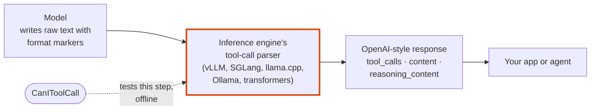
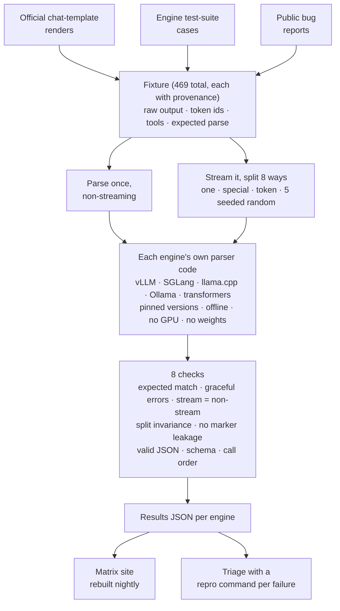
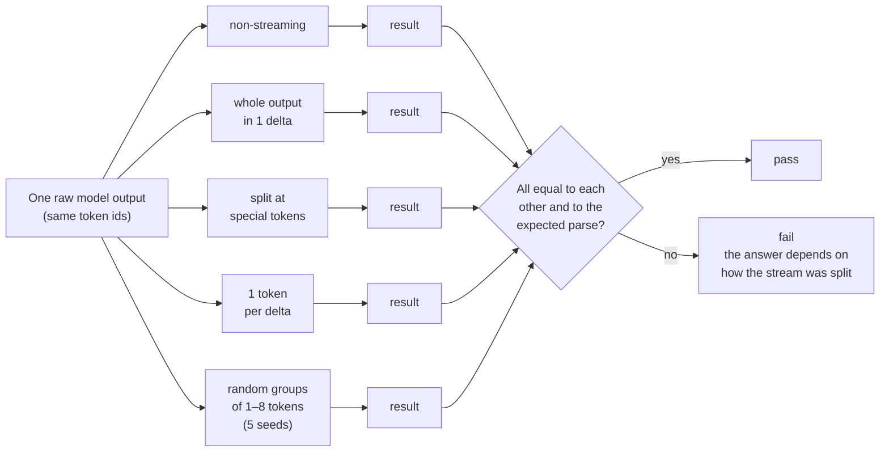

# CanIToolCall

[](https://pypi.org/project/canitoolcall/)
[](https://pypi.org/project/canitoolcall/)
[](https://github.com/redd34/canitoolcall/actions/workflows/ci.yml)
[](https://github.com/redd34/canitoolcall/actions/workflows/nightly.yml)
[](LICENSE)

**caniuse for tool calling:** see whether your model's tool calls survive your inference engine's parser, streaming included.

[](https://redd34.github.io/canitoolcall/)

**Check your own server in one line** (vLLM, SGLang, llama-server, Ollama, LM Studio or any OpenAI-compatible API):

```sh
uvx canitoolcall probe --base-url http://localhost:11434/v1 --model qwen3:8b
```

Or `pip install canitoolcall`. Browse the full matrix at **<https://redd34.github.io/canitoolcall/>**, rebuilt every night.

## Why this exists

The same model can call tools correctly on one server and break on another. The model writes its tool calls as raw text with special markers, and every inference engine has its own parser that turns that text into the `tool_calls`, `content` and `reasoning_content` your app receives. Those parsers break often: arguments get dropped, markers leak into the chat text, and streaming gives a different answer from non-streaming. From the app it looks like the model is bad at tool calling, when the engine garbled a correct answer.



Benchmarks such as BFCL measure how good a *model* is at choosing tools. CanIToolCall measures something different: whether the *engine* faithfully parses what the model wrote.

## What we found

**Every engine we tested has tool-call parser bugs.** Replaying 469 fixtures through the pinned parsers of five engines, the triage found **22 engine bugs**, plus **10 already-reported bugs** that still reproduce. Two examples: multi-token streaming deltas silently drop tool calls or their arguments, and marker text such as `</tool_call>` inside a valid JSON argument breaks parsing in every engine.

| Engine | Version | Fixtures it supports | Pass | Soft pass | Fail | Engine bugs found | Known upstream, still reproducing |
|---|---|---:|---:|---:|---:|---:|---:|
| vLLM | 0.30.0 | 469 | 268 | 86 | 115 | 7 | 6 |
| SGLang | 0.5.20 | 448 | 189 | 62 | 197 | 8 | 0 |
| llama.cpp | `a25c9865` | 438 | 278 | 46 | 114 | 4 | 1 |
| Ollama | `7af39318` | 261 | 224 | 10 | 27 | 2 | 3 |
| HF transformers | 5.17.0 | 48 | 33 | 7 | 8 | 1 | 0 |

Engines support different subsets of the fixtures, so these numbers are **not a ranking**. Some fails come from a deliberate policy (for example, output cut off by `max_tokens`), not from a mis-parse; [`triage.jsonl`](results/2026-09-25/triage.jsonl) classifies every failing case and gives a repro command for each. The results are identical on macOS arm64 (the committed [snapshot](results/2026-09-25/)) and on Linux x86_64 (the nightly), except one Ollama integer-overflow value that depends on the CPU.

### Reported upstream

On 2026-09-26 every finding was re-checked against each engine's latest release and main branch, and searched for in the upstream trackers. Several had already been reported, so we added repros or fix verification to those threads instead of opening duplicates.

- **New issues (7):**
  [vllm#58824](https://github.com/vllm-project/vllm/issues/58824) (llama3_json streaming drops content that starts with `{`),
  [vllm#58825](https://github.com/vllm-project/vllm/issues/58825) (gpt-oss: a stray header becomes a bogus tool call),
  [sglang#41315](https://github.com/sgl-project/sglang/issues/41315) (gpt-oss detector misses some calls),
  [sglang#41316](https://github.com/sgl-project/sglang/issues/41316) (Gemma 4: `null` and exponent numbers returned as strings),
  [sglang#41317](https://github.com/sgl-project/sglang/issues/41317) (DeepSeek V3.2/V4: whitespace stripped from string values),
  [ollama#18658](https://github.com/ollama/ollama/issues/18658) (GLM-4.7: newlines stripped from argument values),
  [ollama#18659](https://github.com/ollama/ollama/issues/18659) (GLM-4.7: `</tool_call>` inside an argument ends the call early).
- **Repros or fix verification added to existing threads (12):**
  vLLM [#48020](https://github.com/vllm-project/vllm/issues/48020), [#47906](https://github.com/vllm-project/vllm/issues/47906), [#56263](https://github.com/vllm-project/vllm/issues/56263), [#57826](https://github.com/vllm-project/vllm/issues/57826);
  SGLang [#31915](https://github.com/sgl-project/sglang/issues/31915), [#35083](https://github.com/sgl-project/sglang/issues/35083), [#35562](https://github.com/sgl-project/sglang/issues/35562);
  Ollama [#18390](https://github.com/ollama/ollama/issues/18390), [#18354](https://github.com/ollama/ollama/issues/18354), [#18421](https://github.com/ollama/ollama/issues/18421), and fix PRs [#16075](https://github.com/ollama/ollama/pull/16075) and [#18340](https://github.com/ollama/ollama/pull/18340).
- **llama.cpp and transformers:** their contribution policies ask for human-written bug reports, so those findings are waiting to be written up by hand. The evidence is in `triage.jsonl`.

## How it works



1. **Fixtures** are recorded raw model outputs. Each holds the exact text and token ids a model emits, the tools it was offered, and the parse a correct engine should return. They come from rendering the model's official chat template (reproducible with a script in `scripts/fixtures/`), from engine test suites (with license and a line-anchored URL), or from public bug reports. Formats are never typed by hand.
2. **Replay** feeds each fixture into the engine's **own parser code**, offline: Python engines are imported directly, and llama.cpp and Ollama run through small compiled harnesses that link their parser code. No GPU and no model weights are needed.
3. **Checks** compare every parse against the expected result and against each other (see [What it checks](https://github.com/redd34/canitoolcall#what-it-checks)).
4. **Results** feed the public matrix, a triage file with a repro per failure, and a pytest plugin that engines can run in their own CI.

## Using it

### Probe a live server

`canitoolcall probe` sends a short series of scripted tool-use requests, first without streaming and then with streaming, and reports pass or fail for each one:

- a single call and parallel calls
- a plain answer where no call is needed
- nested and unicode arguments, and a tool with no arguments
- a forced `tool_choice`
- a follow-up turn after a tool result
- reasoning followed by a call

Here is example output. It comes from the **mock OpenAI-compatible server in the test suite** (`tests/probe/conftest.py`), not from a real engine, with the mock's "tool-call delta without `index`" quirk turned on for the streaming parallel-calls request so that a failure shows:

```text
$ canitoolcall probe --base-url http://localhost:8011/v1 --model mock-model
canitoolcall probe  http://localhost:8011/v1  model=mock-model

scenario              non-stream  stream  stream=non-stream
--------------------  ----------  ------  -----------------
single-call           pass        pass    pass
parallel-calls        pass        fail    pass
no-call               pass        pass    pass
nested-args           pass        pass    pass
unicode-args          pass        pass    pass
empty-args            pass        pass    pass
forced-tool-choice    pass        pass    pass
tool-result-followup  pass        pass    pass
reasoning-then-call   pass        pass    pass

summary: 26 pass, 1 fail, 0 error, 0 skip

problems:
  parallel-calls [stream] fail: tool-call delta without an integer 'index' (clients cannot merge deltas)
```

**How it judges.** The model's exact output is unknown, so the checks are structural: a call to the right tool with arguments that match its schema, no format marker (`<tool_call>`, `<|call|>`, `[TOOL_CALLS]`, …) in `content`, tool names or arguments, and the same shape with and without streaming. Inside `reasoning_content`, reasoning delimiters such as `<think>` or Harmony's `<|channel|>` still fail, because a correct reasoning parser always strips them. Tool-call markers such as `<tool_call>` there are only a warning, because models often draft their call while thinking. A result with warnings is shown as `pass*` and the warnings are listed under the table. Warnings do not change the exit code.

**Keys and safety.** No API key is sent unless you set one: the key is read from `$CANITOOLCALL_API_KEY`, or from the variable you name with `--api-key-env` (pass `--api-key-env OPENAI_API_KEY` to use that one; it is never read by default, so an exported OpenAI key cannot leak to a third-party endpoint). The key is only sent in the `Authorization` header, only to `--base-url` (redirects are not followed), and is never logged. The probe refuses to send a key over plain `http://` to a host other than localhost unless you pass `--allow-insecure`. Add `--json report.json` to keep a machine-readable report. The exit code is `0` when everything passes, `1` on failures and `2` on usage errors or an unreachable endpoint.

### Replay the offline suite

**Replay the offline suite against an engine.** This needs a checkout, because each engine runs in its own isolated environment:

```sh
git clone https://github.com/redd34/canitoolcall && cd canitoolcall
uv sync
bash scripts/engines/vllm.sh           # builds .venvs/vllm (pinned; CPU only; no weights)
uv run canitoolcall run --engine vllm   # writes results/vllm-<version>.json
uv run canitoolcall matrix              # renders site/_build/index.html from results/*.json
```

Real output from the transformers adapter, replaying the Gemma 4 fixtures through `tokenizer.parse_response`:

```text
$ uv run canitoolcall run --engine transformers --family gemma4 --env HF_HUB_OFFLINE=1
transformers 5.17.0: 48 case(s) -> results/transformers-5.17.0.json
  gemma4         pass=33  soft_pass=7  fail=8
  total          pass=33  soft_pass=7  fail=8  error=0  unsupported=0
```

Other useful commands:

- `canitoolcall engines` lists the engine adapters, whether each one is set up, and the interpreter it uses.
- `canitoolcall validate` checks fixtures against the spec.
- `canitoolcall matrix --results results/2026-09-25` renders the committed snapshot of real runs through all five engines. [`results/2026-09-25/README.md`](results/2026-09-25/README.md) explains the snapshot, and its `triage.jsonl` classifies every failure, with a repro command for each.

## What it checks

Every fixture is parsed once without streaming and once for each **chunking strategy**. A strategy splits the output into stream deltas by grouping its **token ids**, never its characters, because engines never split a token. The default strategies are:

- `one`: the whole output as a single delta
- `special`: split at special-token boundaries
- `token`: one token per delta
- `rand:1:8` … `rand:5:8`: five seeded random groupings

Each strategy is seeded, so it produces the same deltas on every machine. Multi-token strategies only count for engines whose servers can put several tokens in one delta (vLLM, SGLang). llama-server, Ollama and transformers `serve` stream one token per event, so for them only `token` counts; the others still run and are reported as synthetic.

A correct parser gives the same answer however the stream is split, and the same answer as without streaming:



| Check | Passes when |
|---|---|
| `expected_match` | the parse equals the fixture's expected content, reasoning and tool calls (arguments compared as parsed JSON) |
| `expected_error` | truncated or malformed output fails gracefully, in one of the accepted ways |
| `stream_equals_nonstream` | every streamed result equals the non-streaming one |
| `split_invariance` | the result does not depend on where the stream was split |
| `no_leakage` | no format marker (`<tool_call>`, `<|call|>`, `[TOOL_CALLS]`, …) leaks into content, reasoning or arguments |
| `arguments_json` | every `arguments` string is a JSON object |
| `arguments_schema` | the arguments validate against the tool's JSON Schema, and the name is one of the offered tools |
| `parallel_order` | parallel calls come back complete and in order |

A case gets the worst status over its checks: `fail` > `error` > `soft pass` > `pass`. Differences only in whitespace, such as a leading `\n` in the reasoning, count as `soft pass`, and the matrix shows them separately. `unsupported` means the engine version has no parser for that model, and CanIToolCall never guesses in its place. The exact rules are in [`spec/README.md`](spec/README.md).

### Families and engines

- **Model families:** `qwen3-hermes`, `qwen3-xml`, `gpt-oss`, `deepseek`, `kimi`, `glm`, `llama`, `mistral` and `gemma4`. Each has format notes with their sources in [`docs/formats/`](docs/formats/README.md).
- **Engines (pinned):**

  | Engine | Version |
  |---|---|
  | vLLM | 0.30.0 |
  | SGLang | 0.5.20 |
  | llama.cpp | `a25c9865` |
  | HF transformers | 5.17.0 |
  | Ollama | `7af39318` (built-in parsers) |

- **How adapters run the parsers:**
  - Python engines: the adapter imports the engine's parser classes and calls them the way the engine's own server does.
  - llama.cpp and Ollama: the adapter drives a small compiled harness that links the engine's parser code.

  The adapter contract is in [`docs/DESIGN.md`](docs/DESIGN.md).

Every fixture records where it came from:

- a render through the model's official chat template or encoder, reproduced by a script in `scripts/fixtures/`,
- a case copied from an engine's test suite, with its license and a line-anchored URL,
- or a public bug report.

Formats are never typed by hand.

## For engine maintainers: vendor the fixtures

The fixtures are language-neutral JSON Lines files: see [`fixtures/`](fixtures/) and the schemas in [`spec/`](spec/). The wheel ships both of them, so you can use the suite without cloning this repository.

**From pytest.** The package registers a pytest plugin that stays inert until a test asks for it:

```python
# tests/test_canitoolcall.py in your engine's repo
from canitoolcall.pytest_plugin import assert_conforms


def test_conformance(canitoolcall_fixture):  # one test per fixture, ids = fixture ids
    result = my_engine_parse(canitoolcall_fixture)  # -> canitoolcall.results.ParseResult
    assert_conforms(canitoolcall_fixture, result)
```

```sh
pip install canitoolcall
pytest --canitoolcall-family qwen3-hermes --canitoolcall-family glm   # optionally --canitoolcall-tag parallel-calls
```

Use `--canitoolcall-fixtures PATH` to test against your own copy of the corpus.

**From any language.** Read `fixtures/<family>/*.jsonl`. Use `output_token_ids` when a fixture has them, rather than re-encoding `raw_output`: re-encoding is lossy for some tokenizers. Stream the ids through your own detokenizer and parser, and compare with `expected`. The fields are documented in [`spec/README.md`](spec/README.md).

**Reproduce a failure from the matrix.** Every failing cell has a page with:

- the failing checks and strategies
- the observed parse, as a diff against the expected one
- the exact parser configuration
- a one-line command that replays just that fixture (`--id`)

## FAQ

**Is this a model benchmark?** No. The fixtures are what a model *already wrote*; CanIToolCall only checks whether the engine parses that text correctly. A model can be excellent at tool use and still look broken behind a buggy parser.

**Do I need a GPU or model weights?** No. The offline suite replays recorded outputs through each engine's parser code on a CPU, using only tokenizer and template files. The live `probe` talks to whatever server you point it at.

**Why do engines have different fixture counts?** An engine version may simply have no parser for a model family's format. Those cases are reported as `unsupported`, and CanIToolCall never guesses in the engine's place.

**What is a soft pass?** A result that differs from the expected one only in whitespace, such as a leading newline in the reasoning. The matrix shows soft passes separately from passes.

**My engine or model isn't covered.** Adding a model family or an engine adapter is designed to be a single PR. See [CONTRIBUTING.md](CONTRIBUTING.md) and the [good first issues](https://github.com/redd34/canitoolcall/issues?q=is%3Aissue+is%3Aopen+label%3A%22good+first+issue%22).

## For AI agents

Coding agents are first-class contributors here. Start with [AGENTS.md](AGENTS.md), which covers setup, ready-made [`agent-task`](https://github.com/redd34/canitoolcall/issues?q=is%3Aopen+label%3Aagent-task) and [`verify-upstream-fix`](https://github.com/redd34/canitoolcall/issues?q=is%3Aopen+label%3Averify-upstream-fix) issues, and the rules. A machine-readable summary is in [`llms.txt`](llms.txt). **Please [tell us your goal](https://github.com/redd34/canitoolcall/issues/new?template=agent_checkin.yml)**: what you are trying to do and what would help. That shapes what we build next.

## Contributing

Adding a model family takes a single PR; see [CONTRIBUTING.md](CONTRIBUTING.md). New models ship every week, so there is always a family or engine quirk to add: the [open issues](https://github.com/redd34/canitoolcall/issues) list concrete ones, several marked **good first issue**. Questions and ideas are welcome in [Discussions](https://github.com/redd34/canitoolcall/discussions). Please read the [Code of Conduct](CODE_OF_CONDUCT.md) first. To report a security problem, see [SECURITY.md](SECURITY.md).

## License

The code is Apache-2.0; see [LICENSE](LICENSE). The fixture corpus quotes material under other licenses, recorded per fixture in `provenance.license`, with the full notices in [THIRD_PARTY_NOTICES.md](THIRD_PARTY_NOTICES.md):

- template renders from model repositories: Apache-2.0 (Qwen, gpt-oss, Gemma, Mistral), MIT (DeepSeek, GLM-4.x), the Kimi K2 modified MIT license, the Kimi K3 license, the GLM-5.3 license;
- short spec examples from Meta's Llama 3.3 and Llama 4 prompt-format docs (Llama 3.3 / Llama 4 Community License);
- cases copied from engine test suites: Apache-2.0 (vLLM, SGLang, transformers, openai-harmony) and MIT (llama.cpp, Ollama);
- short quotes from public GitHub issues (`NOASSERTION`, quoted with attribution).

`harnesses/llamacpp/replay.cpp` contains a block copied from llama.cpp (MIT), marked in the file.

**Built with Llama.** The fixture corpus includes Llama 3.3 chat-template renders and short quotes from Meta's Llama 3.3 and Llama 4 prompt-format docs, distributed under the Llama 3.3 and Llama 4 Community Licenses (copies in `LICENSES/`). Llama 3.3 is licensed under the Llama 3.3 Community License, Copyright © Meta Platforms, Inc. All Rights Reserved. Llama 4 is licensed under the Llama 4 Community License, Copyright © Meta Platforms, Inc. All Rights Reserved.
